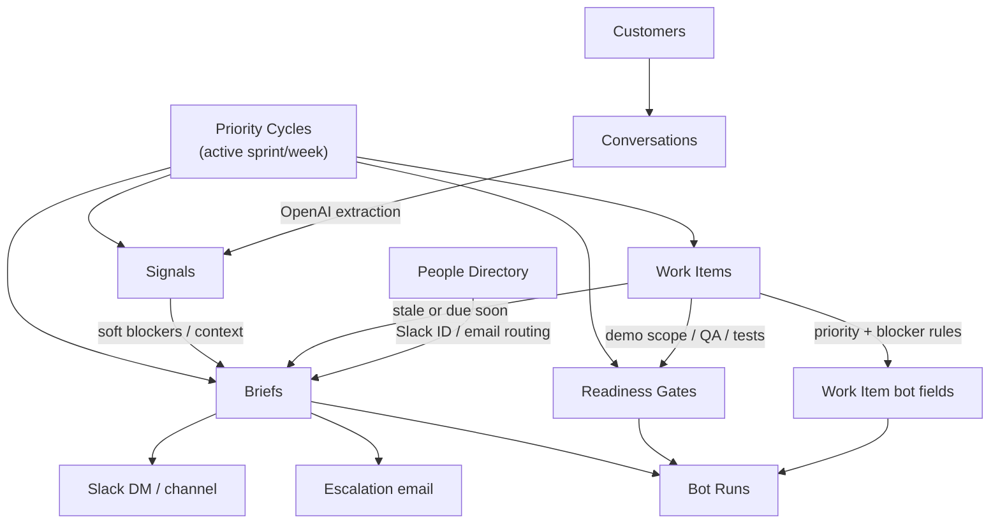

# Central Agent

Central Agent is the Phase 1 operations bot for the TDF Design Manager workflow. It reads the Notion operating system, computes what needs attention, writes bot-owned fields back to Notion, and optionally delivers Slack and email notifications.

The app is designed around a simple rule: humans own the work records, the bot owns computed context and notification history.

## What It Does

- Reads the active sprint or week from `Priority Cycles`.
- Reads related `Work Items`, accepted `Signals`, existing `Briefs`, `Bot Runs`, active people, readiness gates, and recent conversations.
- Extracts new signals from recently updated conversation transcripts and summaries.
- Recomputes work item priority, hard-blocked state, missing priority inputs, and status nudge eligibility.
- Creates or updates the sprint `Readiness Gate`.
- Creates `Briefs` for daily summaries, owner nudges, sprint completion reminders, and escalations.
- Sends Slack DMs, Slack escalation-channel posts, and escalation emails in `live` mode.
- Writes a `Bot Runs` audit row for every non-dry-run batch.

## How To Run

Use the bundled Node runtime if `npm` is not available in the shell:

```bash
/Users/artyrakoto/.cache/codex-runtimes/codex-primary-runtime/dependencies/node/bin/node --env-file-if-exists=.env --import tsx src/app.ts --mode=dry-run
```

Run modes:

- `dry-run`: reads Notion and evaluates the lifecycle without writing rows or sending messages.
- `persist-only`: writes Notion records and marks briefs as `Queued`, but does not send Slack or email.
- `live`: writes Notion records, marks briefs as `Sent`, and sends Slack/email.

Package scripts mirror the same commands when `npm` is available:

```bash
npm run check:env
npm run check:notion
npm run check:slack
npm run check:email
npm run check:routing
npm run dry-run
npm run persist-only
```

Vercel calls `api/cron.ts`, checks `Authorization: Bearer $CRON_SECRET`, and runs the bot in `live` mode. The deployed cron schedule in `vercel.json` is every 30 minutes from 12:00-23:59 UTC, Monday-Friday.

## Team Codex Skills

This repo includes Tenpo-style repo-local skills under `.agents/skills/`. Use them when asking Codex to list, summarize, inspect, or safely update Central Agent Notion tables.

Example prompts:

- `$central-agent-status list blocked work items.`
- `$central-agent-status summarize briefs and bot runs.`
- `$central-agent-update-work mark "Search bar task" as In Progress.`
- `$central-agent-tables explain which fields the bot owns.`

Codex UI discovers repo-local skills from `.agents/skills/<skill-folder>/SKILL.md`.

## Environment

Local secrets live in `.env`, which is intentionally git-ignored.

Required groups:

- Runtime: `CRON_SECRET`, `BOT_TIMEZONE`, `OPENAI_API_KEY`, `OPENAI_MODEL`
- Slack: `SLACK_BOT_TOKEN`, `SLACK_ESCALATION_CHANNEL_ID`, `SLACK_BRIEF_DM_USER_ID`
- Notion: one database ID for each Phase 1 table, plus `NOTION_TOKEN`
- SMTP: `SMTP_HOST`, `SMTP_PORT`, `SMTP_SECURE`, `SMTP_USER`, `SMTP_PASS`, `EMAIL_FROM`, `EMAIL_REPLY_TO`

The Slack bot token must be a Bot User OAuth token (`xoxb-...`) with member lookup permissions when using the people backfill script.

## Notion Tables

### Human-Owned Tables

`Customers`
: Source of customer context, ownership, customer stage, related conversations, related work, and rollups like open work items.

`Conversations`
: Source of transcripts, notes, summaries, customer references, and extraction status. The bot reads recent conversation text and creates derived `Signals`.

`Work Items`
: Source of sprint work, owners, due dates, status, priority inputs, blocker state, dependencies, QA/test evidence, and demo scope. Humans own the item status and inputs.

`Priority Cycles`
: Source of the active sprint or week. The bot expects exactly one active cycle and scopes most reads/writes to that cycle.

`People Directory`
: Routing table for Slack DMs and escalation emails. Active people with `Slack ID` can receive DMs; active people with `Email` are included in escalation emails.

### Bot-Owned Or Bot-Updated Tables

`Signals`
: Bot creates signals from conversation extraction. Signals include type, source table/row, confidence, review status, relations, and a dedupe key.

`Readiness Gates`
: Bot creates or updates the demo readiness gate for the active cycle. It evaluates demo-scope work items, hard blockers, QA evidence, test evidence, and GitHub CI state.

`Briefs`
: Bot creates notification records before or alongside delivery. These records are also used for dedupe and reminder cadence.

`Bot Runs`
: Bot writes an audit row for each non-dry-run batch, including batch ID, trigger source, result, and summary counts.

## Table Flow



## Bot Lifecycle

1. `runCentralAgent` builds a batch ID and loads runtime config.
2. `runPhase1OpsMvp` creates Notion repositories from the configured database IDs.
3. The bot loads a runtime snapshot:
   - exactly one active `Priority Cycle`
   - work items linked to that cycle
   - signals linked to that cycle
   - readiness gates linked to that cycle
   - briefs linked to that cycle
   - recent bot runs
   - active people
   - recent conversations
4. Recent conversations are sent to OpenAI when they have a customer ID and transcript or summary text. New extracted signals are created unless their deterministic signal ID already exists.
5. Every active work item in the cycle is evaluated for:
   - hard blocker state
   - priority score
   - priority recommendation
   - missing priority inputs
   - review requirement
6. The active cycle's demo readiness is evaluated. The bot updates the existing gate or creates one if it does not exist.
7. The bot evaluates stale and due-soon work items. It creates reminder briefs when no matching non-failed brief already exists.
8. The daily brief is created on business days within the configured local 8:30-9:00 window when the daily dedupe key does not already exist.
9. In `live` mode, the bot delivers:
   - daily brief to Slack
   - first and second reminders as Slack DMs when the owner has a Slack ID
   - third reminder and later as Slack escalation plus one batched email to active people
10. In non-dry-run modes, the bot writes a `Bot Runs` row summarizing what happened.

## What The Bot Updates

### Work Items

The bot only updates computed/bot-owned fields:

- `Last Activity Source`
- `Latest Bot Note`
- `Bot History URL`
- `Computed Hard Blocked`
- `Priority Score`
- `Priority Recommendation`
- `Priority Needs Review`
- `Priority Missing Inputs`
- `Status Nudge Eligible`

It does not create work items and does not change human-owned status, owner, due date, QA, tests, confirmed priority, dependencies, or impact inputs.

### Signals

The bot creates conversation-derived signal rows with:

- `Signal ID`
- `Signal Type`
- `Source Table`
- `Source Row ID`
- `Rule Name`
- `Confidence`
- `Review Status`
- relations back to conversations, customers, work items, priority cycles, briefs, and bot runs when available
- `Dedupe Key`

### Readiness Gates

The bot creates or updates:

- `Gate ID`
- `Gate Type`
- `Priority Cycle`
- `GitHub CI State`
- `GitHub CI Checked At`
- `Confirmed Status`
- `Last Evaluated At`
- linked `Work Items`

Rollups/formulas on the Notion side can expose blocked count, missing QA count, missing tests count, demo ready, and computed status.

### Briefs

The bot creates briefs for:

- `Daily Brief`
- `Status Update Nudge`
- `Sprint Completion Reminder`

Fields include route, recipient, scheduled time, status, body, dedupe key, cooldown, source snapshot, and relations to cycles, gates, work items, signals, and bot runs.

### Bot Runs

The bot writes one audit row per non-dry-run batch with:

- `Run ID`
- `Batch ID`
- `Run Type`
- `Rule Name`
- `Occurred At`
- `Result`
- `Trigger Source`
- `Source Row IDs`
- `Target Row IDs`
- `Resulting Change`

## Reminder And Escalation Rules

- Work items are considered for reminders when their status is `Ready`, `In Progress`, `Blocked`, or `In Review`.
- A stale item is one with no meaningful update for at least two business days.
- A due-soon item is due within two business days.
- First and second matching reminders are routed as DMs when the owner has a Slack ID.
- Third matching reminder and later escalate to the configured Slack channel and a batched email to all active people with email addresses.
- Existing non-failed briefs with the same dedupe key suppress duplicate sends.

## People Directory Backfill

Use this after adding or changing Slack names:

```bash
/Users/artyrakoto/.cache/codex-runtimes/codex-primary-runtime/dependencies/node/bin/node --env-file-if-exists=.env --import tsx scripts/backfill-people-directory.ts --mode=dry-run
```

Apply after reviewing the matches:

```bash
NOTION_ALLOW_PEOPLE_BACKFILL=true /Users/artyrakoto/.cache/codex-runtimes/codex-primary-runtime/dependencies/node/bin/node --env-file-if-exists=.env --import tsx scripts/backfill-people-directory.ts --mode=apply
```

The script can also mark people active when they have an email and copy `Department` into `Team`.

## Schema Maintenance

Check schemas:

```bash
npm run check:notion-schema
npm run ensure:notion-work-items-schema -- --mode=dry-run
```

Apply schema changes only when intentional:

```bash
NOTION_ALLOW_SCHEMA_MUTATION=true npm run ensure:notion-schema -- --mode=apply
```
